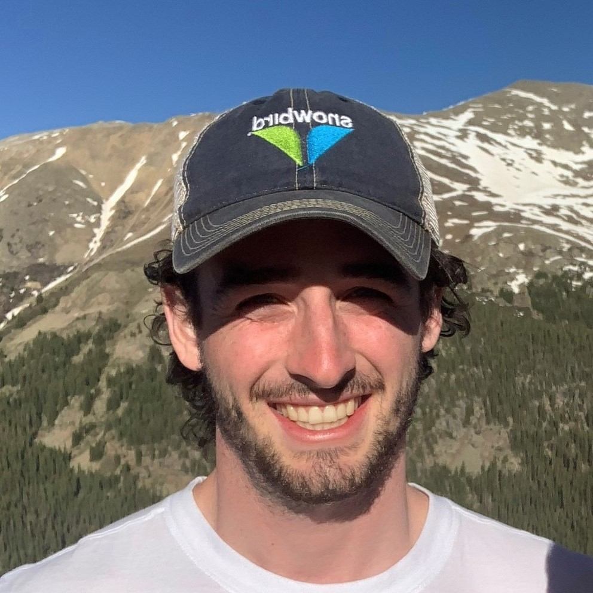

## Biography

Gerard Donahue is a PhD student in Computer Science in the [Khoury College of Computer Sciences](https://www.khoury.northeastern.edu) at Northeastern University, Boston MA. Broadly speaking, his interests lie at the intersection of *reinforcement learning*, *imitation learning*, and *video understanding*. Gerard is currently a research assistant under [Dr. Ehsan Elhamifar](https://www.ccs.neu.edu/home/eelhami/) where he works to discover new methods for procedural task execution.

Before beginning his doctoral studies at Northeastern, Gerard obtained his B.S in Computer Science from the [University of New Hampshire](https://www.unh.edu) (UNH), where he earned Magna Cum Laude upon graduation. At UNH, Gerard worked in the realm of *Inverse Reinforcement Learning* under the advisement of [Dr. Marek Petrik](http://marek.petrik.us/).

In the summer of 2022, Gerard worked as a machine learning research intern at [Ultra Electronics](https://www.ultra.group) in Austin, TX. At Ultra, Gerard used his knowledge of reinforcement learning to spearhead research in the field of *Target Localization* in collaboration with [Dr. Guni Sharon](https://people.engr.tamu.edu/guni/index.html) at Texas A&M. In 2020, Gerard worked as a software engineer at [Intel Corporation](https://www.intel.com/content/www/us/en/homepage.html).

## Research Interest

While Gerard's research interests span widely, his primary interest is to harness the power of machine learning algorithms to increase the value of modern technology. He sees reinforcement learning as a prime way to accomplish this, where learning from reward feedback can tackle many real-world problems; in autonomous systems, computer vision, and much more.

## Workshops

- [Unbiased Efficient Feature Counts for Inverse RL](neurips-2020.pdf)
    -- **Gerard Donahue**, Brendan Crowe, Marek Petrik, Daniel S. Brown NeurIPS. Workshop on Safe and Robust Control of Uncertain Systems, 2021.

## News!
- One paper accepted to CVPR 2024, titled "Learning to Predict Activity Progress by Self-Supervised Video Alignment". 

## Contact
#### If you are interested in my research or would like to just chat, please reach out :)
* **Email**: donahue [dot] g [at] northeastern.edu
* [LinkedIn Profile](https://www.linkedin.com/in/gerard-donahue-ml)

***
> "I believe things cannot make themselves impossible."
> -- Stephen Hawking

  